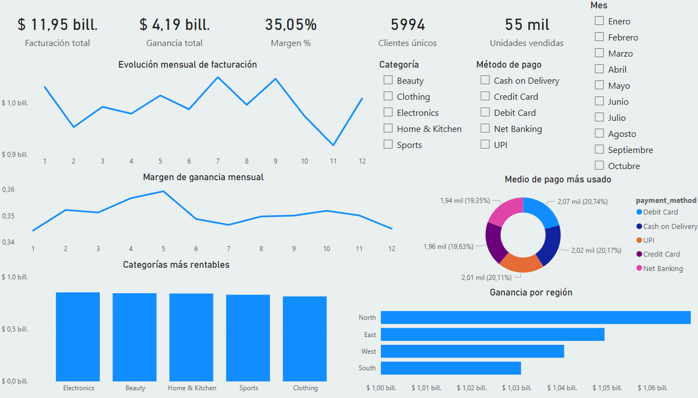
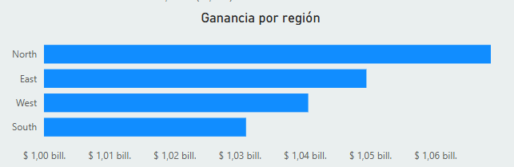
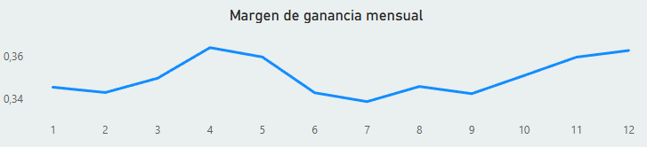
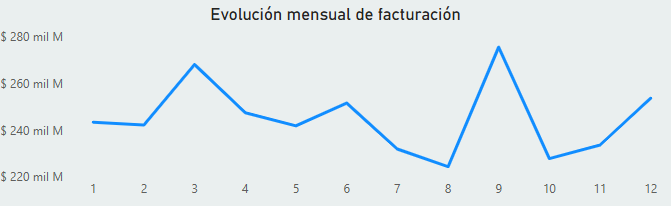
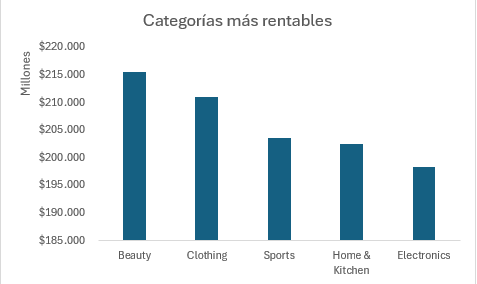
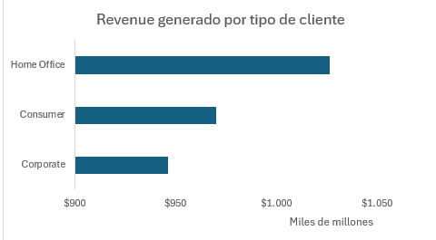

## 📊 Análisis de rendimiento de ventas y  rentabilidad

### 📌 Descripción del Proyecto

Este proyecto consiste en el desarrollo de un dashboard interactivo en Power BI para analizar el desempeño comercial de distintas regiones, categorías y tipos de clientes durante el año.

El objetivo fue identificar patrones de revenue, rentabilidad y comportamiento regional para detectar oportunidades de mejora y dinámicas diferenciales en el negocio.

------------------------------------------------------------------------

### 🎯 Objetivos del Análisis

-   Analizar revenue y margen de ganancia por región.
-   Evaluar evolución mensual de ingresos y rentabilidad.
-   Identificar categorías y segmentos de clientes más rentables.
-   Detectar tendencias y comportamientos diferenciales entre regiones.
-   Generar insights accionables basados en datos.

------------------------------------------------------------------------

### 🛠 Herramientas Utilizadas

-   Power BI (modelado y visualización)
-   DAX (medidas y cálculos de margen)
-   Excel (exploración y limpieza inicial de datos)

------------------------------------------------------------------------

### 📂 Fuente de Datos

El análisis fue realizado utilizando el dataset público Retail Business Analytics Dataset (10K+ Orders) disponible en Kaggle.

El conjunto de datos contiene más de 10.000 transacciones comerciales e incluye variables clave como revenue, profit, categoría, región y segmentación de clientes, permitiendo un análisis integral de performance comercial y rentabilidad.

🔗 Dataset original:
https://www.kaggle.com/datasets/amar5693/retail-business-analytics-dataset-10k-orders

------------------------------------------------------------------------

### 📈 KPIs Principales

-   Facturación total
-   Ganancia total
-   Margen de Ganancia (%)
-   Unidades Vendidas
-   Clientes totales
-   Unidades vendidas

------------------------------------------------------------------------

### 📊 Dashboard Overview

------------------------------------------------------------------------

### 🔎 Insights Clave

#### 1️⃣ Diferencia de Profit entre Regiones

La región Norte registra el mayor nivel de ganancias, alcanzando aproximadamente:

$1.068.527.647.700

Mientras que la región Sur presenta:

$1.030.989.367.300

La diferencia con la región que le sigue (Oeste) es de aproximadamente 9 mil millones.

------------------------------------------------------------------------

#### 2️⃣ Dinámica Diferencial de Margen

Desde septiembre, se observa una divergencia clara en la evolución del margen de ganancia:

-   El Sur incrementa su margen de forma sostenida
-   Las demás regiones presentan una tendencia descendente

El margen del Sur pasa de:

-   33% en julio
-   a 36,28% en diciembre

Esto representa:

-   +3,28 puntos porcentuales
-   ~10% de mejora relativa en rentabilidad

------------------------------------------------------------------------

#### 3️⃣ Crecimiento de Revenue hacia el Cierre del Año

En los últimos dos meses del año, el revenue creció aproximadamente:

$16.000.000.000

Todas las regiones muestran crecimiento respecto a noviembre.

------------------------------------------------------------------------

#### 4️⃣ Categorías con Mayor Impacto en el Sur

En la región Sur:

-   Clothing (~$609.785.306.800)
-   Beauty (~$602.645.158.300)

------------------------------------------------------------------------

#### 5️⃣ Segmentación por Tipo de Cliente

1.  Home Office (~$1.026.554.812.800)
2.  Consumer (~$970.058.269.100)

------------------------------------------------------------------------

### 🧠 Conclusión

Aunque la región Sur no lidera en volumen ni en revenue total, es la única que muestra una mejora sostenida y significativa en margen durante el segundo semestre.

Esto la posiciona como:

-   La región con mejor dinámica de eficiencia.
-   Un posible modelo replicable para otras regiones.
-   Una oportunidad de análisis profundo para identificar qué factores impulsaron la mejora.
